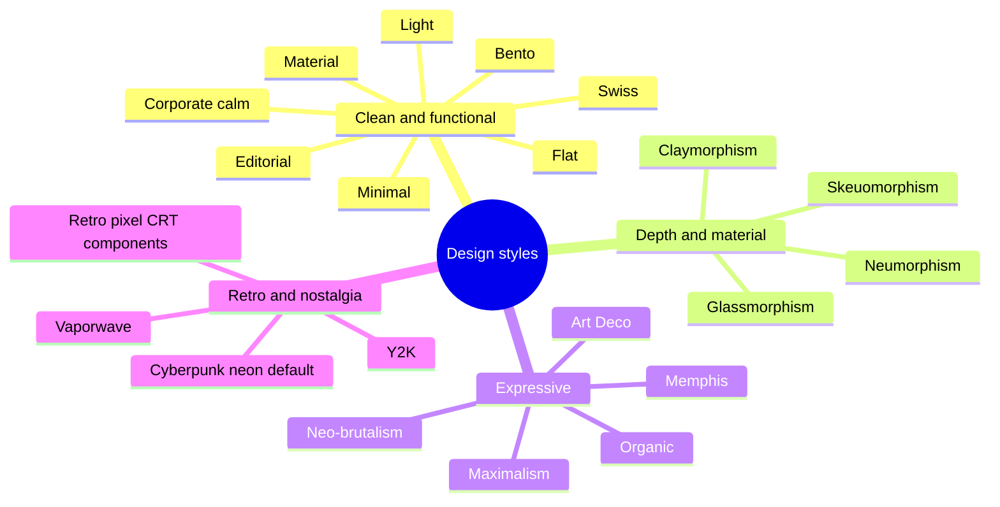

# Cyberdyne Design System

A comprehensive Svelte 5 component library built for **Cyberdyne** — powering products across Crypto, Machine Learning, and Research.

Dark-first, cyberpunk-inspired design system with **256 components** across 19 categories, design tokens, and full Storybook documentation.

## Storybook

**Live documentation:** [https://cyberdynecorp.github.io/svelte_components_library/](https://cyberdynecorp.github.io/svelte_components_library/)

**Local development:**

```bash
pnpm install
pnpm dev
# → http://localhost:6006
```

**Build static docs:**

```bash
pnpm build-storybook
# Output → docs/
```

The Storybook includes:
- Interactive component playground with controls
- Auto-generated API documentation for every component
- Design token reference (colors, typography, spacing)
- Getting started guide and architecture overview

All stories use the `args` pattern for Storybook Svelte CSF compatibility. Visual regression testing is handled via Playwright.

## Packages

| Package | Description |
|---------|------------|
| `@cyberdynecorp/svelte-ui-foundation` | Design tokens, CSS custom properties, typography, colors, spacing, animations |
| `@cyberdynecorp/svelte-ui-core` | 256 UI components across 19 categories |

## Installation

```bash
# Configure registry
echo "@cyberdynecorp:registry=https://npm.pkg.github.com" >> .npmrc

# Install
pnpm add @cyberdynecorp/svelte-ui-foundation @cyberdynecorp/svelte-ui-core

# Optional — only if you use the cesium/ 3D globe components
pnpm add cesium
```

> The `cesium/` category requires the optional `cesium` peer dependency plus
> consumer-side asset hosting (`CESIUM_BASE_URL`). See the `Overview/Cesium
> Integration` page in Storybook and `documentation/CESIUM_ROADMAP.md`.

### Setup

Import the foundation styles in your root layout:

```svelte
<script>
  import "@cyberdynecorp/svelte-ui-foundation/styles";
</script>

{@render children()}
```

Optional calm theme preset (`data-theme="calm"` / `"calm-dark"`) and light/dark/system
preference with a no-flash init script:

```svelte
<script>
  import "@cyberdynecorp/svelte-ui-foundation/styles";
  import "@cyberdynecorp/svelte-ui-foundation/themes/calm.css";
  import { ThemeToggle } from "@cyberdynecorp/svelte-ui-core";
</script>

<ThemeToggle includeSystem themes={{ light: "calm", dark: "calm-dark" }} persistKey="app.theme" />
```

`createThemePreference` and `themeInitScript` live in `@cyberdynecorp/svelte-ui-foundation/theme`;
see `Overview/Design Tokens` → Themes in Storybook for the `app.html` snippet.

Design-style presets — CSS-only themes, one file each, activated with `data-theme`:

```svelte
<script>
  import "@cyberdynecorp/svelte-ui-foundation/styles";
  import "@cyberdynecorp/svelte-ui-foundation/themes/glass.css";
</script>

<div data-theme="glass">…</div>
```



| Style | Theme (`data-theme`) | Import |
|-------|----------------------|--------|
| Cyberpunk / neon | default (no attribute) | `styles` |
| Light | `light` | `styles` |
| Corporate / calm | `calm`, `calm-dark` | `themes/calm.css` |
| Retro / pixel / CRT | — (use the `retro/` components) | — |
| Minimal | `minimal` | `themes/minimal.css` |
| Flat | `flat` | `themes/flat.css` |
| Material | `material` | `themes/material.css` |
| Swiss | `swiss` | `themes/swiss.css` |
| Organic | `organic` | `themes/organic.css` |
| Maximalism | `maximalism` | `themes/maximalism.css` |
| Y2K | `y2k` | `themes/y2k.css` |
| Glassmorphism | `glass` | `themes/glass.css` |
| Neumorphism | `neumorphism` | `themes/neumorphism.css` |
| Skeuomorphism | `skeuomorphism` | `themes/skeuomorphism.css` |
| Neo-brutalism | `brutalism` | `themes/brutalism.css` |
| Bento | `bento` | `themes/bento.css` |
| Claymorphism | `clay` | `themes/clay.css` |
| Memphis | `memphis` | `themes/memphis.css` |
| Vaporwave | `vaporwave` | `themes/vaporwave.css` |
| Art Deco | `art-deco` | `themes/art-deco.css` |
| Editorial | `editorial` | `themes/editorial.css` |

Every preset defines all semantic/component tokens and passes WCAG AA on the same pairings as
calm. Presets name their web fonts but do not load them; see each file's header.

Use components:

```svelte
<script>
  import {
    Button, Card, TextInput, Badge,
    TokenBalance, Terminal, CommandPalette
  } from "@cyberdynecorp/svelte-ui-core";
</script>

<Card variant="elevated">
  <TextInput label="Search" placeholder="Search transactions..." />
  <Button variant="brand">Execute</Button>
  <Badge variant="success">Online</Badge>
</Card>
```

## Components (255)

### Primitives (14)
`Button` · `Badge` · `Icon` (20+ built-in) · `IconButton` · `Avatar` · `Tooltip` · `ChipButton` · `ToggleGroup` · `AvatarGroup` · `Flag` · `InformationPill` · `CopyButton` · `ThemeToggle` · `StarRating`

### Forms (21)
`TextInput` · `PasswordInput` · `Select` · `Checkbox` · `Radio` · `Switch` · `Textarea` · `FileDropzone` · `DateRangePicker` · `MultiSelect` · `TagInput` · `NumberInput` · `MoneyInput` (locale money entry as decimal strings; crypto/custom assets via `decimals`) · `ComboBox` · `RangeSlider` · `CodeEditor` · `ColorPicker` · `SearchInput` · `DatePicker` · `TimePicker` · `ScheduleConfig`

### Feedback (13)
`Alert` · `Dialog` · `Notification` · `Toast` (queue manager) · `Skeleton` (loading placeholders) · `Accordion` · `Dropdown` · `ProgressRing` · `Stepper` · `ErrorBoundary` · `Carousel` · `VideoPlayer` · `GlobeLoader` (animated canvas globe loader)

`Alert` takes `role`: `"alert"` (default, assertive), `"status"` (polite live region, for non-urgent updates such as "Saved") or `"note"` (static advisory text, not announced).

### Navigation (10)
`Tabs` · `Breadcrumb` · `Sidebar` · `Header` · `MenuItem` · `BreadcrumbOverflow` · `NavBar` · `MegaMenu` · `MenuBar` · `BottomNav`

`Tabs` has two modes. Items without `href` are an ARIA tab widget (`role="tablist"`, arrow keys) that switches content in place. When items carry `href` they are link tabs for section navigation across routes: a `<nav>` landmark named by `ariaLabel`, holding a list of `<a>` elements with `aria-current="page"` on the `activeId` item. Link tabs keep normal link keyboard behaviour (Tab, Enter) and do not call `onchange`; drive `activeId` from the current route.

### Data Display (20)
`Table` (sortable columns) · `Pagination` · `ProgressBar` · `StatusBadge` · `EmptyState` · `StickyNote` · `VirtualizedList` · `InfiniteScroll` · `FileTree` · `DiffViewer` · `Calendar` · `Kanban` · `DataTable` · `FilterBar` · `SortableList` · `OrgChart` · `WeatherCard` · `CurrencyDisplay` (locale money amounts, crypto/custom assets via `decimals`, masked mode) · `KpiCard` (KPI tile with trend + delta; `value` takes a string or a snippet) · `BudgetBar` (money budget meter)

`StatusBadge` has six statuses: `active`, `inactive`, `pending`, `error`, `warning` and `info`. With `indicator="icon"` each one shows its own icon (check, minus, clock, x, triangle, info) and a default label, so badges can be told apart without colour (WCAG 1.4.1). `tone` (`success` | `neutral` | `warning` | `error` | `info`) overrides the colour, and the `icon` snippet replaces the marker. The default `indicator="dot"` renders as before.

`Table` accepts `caption` (with `captionHidden` for a screen-reader-only caption), `rowHeader` (column key rendered as `<th scope="row">`), `rowAttributes(row, rowIndex)` for per-row `data-*` / `aria-current` / `class`, and a `cell` snippet that receives `{ row, column, rowIndex }` for every column without its own `cell`. `rowIndex` is the displayed position after sorting.

### Layout (9)
`Card` · `AppLayout` · `PageHeader` · `ContentSlot` · `Drawer` (focus trap, Escape / backdrop close, `closeLabel`, `onclose`) · `SplitView` · `GridLayout` · `PageShell` · `FloatingPanel` (draggable + resizable window)

### Overlay (5)
`Modal` · `ModalBackdrop` · `ContextMenu` · `Popover` · `CommandPalette` (Cmd+K)

### Auth (2)
`LoginPage` (credentials + wallet modes) · `WalletConnect` (MetaMask, WalletConnect, Coinbase, Phantom)

### Chat (8)
`Chatbox` · `ChatPanel` · `ChatResponse` · `PromptExample` · `WelcomeText` · `BotAnswer` · `CommentThread` · `ChatSidebar` (conversation list with rename/delete)

### Crypto / Web3 (14)
`TokenBalance` · `TokenBalanceRow` (compact list row: exact token amount, fiat value or unpriced label, chain label; `as="li"` for lists) · `TransactionList` · `AddressDisplay` · `NetworkBadge` (optional `chainId`; `showStatus={false}` hides the connection dot) · `NFTCard` · `PriceDisplay` · `MetricCard` · `GasEstimate` · `TierBadge` (6-tier NFT access system) · `SwapInterface` · `TokenSelector` · `StakingCard` · `TransactionConfirm`

### ML / Data Tools (11)
`CodeBlock` (syntax highlighting) · `Terminal` · `LogViewer` (severity filtering) · `Slider` · `StepProgress` · `Timeline` · `DataChart` (chart wrapper) · `Kbd` (keyboard shortcuts) · `NotebookCell` · `ModelCard` · `ConfusionMatrix`

### Graph & Search (2)
`GraphViewer` (force-directed network graph with community detection, zoom/pan, search) · `SemanticSearch` (vector search results with relevance scores)

### Charts (21)
`LineChart` · `BarChart` · `AreaChart` · `HeatmapChart` · `PieChart` · `Sparkline` · `Gauge` · `TreeMap` · `GanttChart` · `ActivityHeatmap` · `CumulativeFlow` (CFD) · `AgingWIP` · `BurndownChart` · `VelocityChart` · `SankeyChart` · `ScatterChart` · `VennDiagram` · `WordCloud` · `ElevationProfile` (terrain cross-section + Fresnel overlay) · `ChartFrame` (accessible figure: title/description + data-table fallback with "Show data" toggle) · `ChartLegend` (shape and dash markers, readable in grayscale)

Every `ChartFrame` chart (Line, Area, Bar, Pie, Scatter, TreeMap, Sankey, Sparkline, Gauge, Heatmap) takes a typed `labels` prop to localize its accessible name, data-table column headers and caption, "Show data"/"Hide data" toggle and legend name, e.g. `labels={{ columns: { label: "Categoria", value: "Valor" }, showData: "Mostrar dados" }}`.

`LineChart`, `AreaChart`, `BarChart`, `PieChart`, `Sparkline`, `SankeyChart`, `ScatterChart`, `TreeMap`, `Gauge` and `HeatmapChart` accept `title` / `description` and render a screen-reader data table; the series charts also mark series with shapes as well as colour. `AgingWIP` and `GanttChart` bars become named, keyboard-operable buttons (Enter/Space) only when `onitemclick` / `onTaskClick` is set; otherwise the chart is a single image. Every chart story runs axe in failing mode (`parameters.a11y.test = "error"`).

`SankeyChart` and `Sparkline` take `formatValue?: (value: number) => string` for displayed values; in `SankeyChart` it applies to node labels, tooltips and the data table, e.g. `formatValue={(v) => new Intl.NumberFormat("pt-BR", { style: "currency", currency: "BRL" }).format(v)}`. Sankey node label size follows the body-sm scale (`0.875rem`) and can be overridden with `--cy-sankey-label-size`.

### Editor (6)
`BlockEditor` (Notion-style blocks with slash menu) · `MarkdownEditor` (with Mermaid diagram support) · `MarkdownPreview` · `MarkdownToolbar` · `MindMap` · `RichTextEditor` (WYSIWYG)

### Maps (1)
`MapView` (Leaflet with dark tiles, custom controls, geolocation)

### Cesium — 3D Globe (50)
Headless, controlled CesiumJS globe toolkit. `cesium` is an **optional peer dependency** (lazy-imported, never bundled). Entity/billboard layers take a uniform `opacity` (0–1); tracked-entity layers take `labelMode` (`all`/`perEntity`/`selected`/`none`); `TrackedEntitiesLayer` is the styling escape hatch.
- **Engine:** `CesiumGlobe` · `Terrain` · `ImageryLayer`
- **Tilesets/models/contours:** `Cesium3DTiles` · `OsmBuildingsLayer` · `GooglePhotorealisticTiles` · `ModelsLayer` · `ElevationContours`
- **Vector:** `GeoJsonLayer` · `KmlLayer` · `CzmlLayer` · `MarkersLayer` · `PolygonsLayer` · `PolylinesLayer` · `LabelsLayer` · `PolygonHeatmapsLayer`
- **Live entities:** `TrackedEntitiesLayer` · `AircraftLayer` · `VesselsLayer` · `SatellitesLayer` · `EarthquakesLayer` · `WildfiresLayer` · `VolcanoesLayer` · `AirportsLayer` · `TowersLayer` · `CellSitesLayer` · `WebcamsLayer` · `PowerPlantsLayer` · `AirQualityLayer` · `TideGaugesLayer` · `GdacsLayer` · `TsunamiLayer` · `CyclonesLayer` · `AuroraLayer` · `SubmarineCablesLayer` · `FarmsLayer` · `CoverageLayer` · `UserLocationLayer`
- **Raster timelines:** `WeatherTileLayer` · `NasaGibsLayer`
- **Particles/flow:** `WindParticlesLayer` · `WaveParticlesLayer` · `StreamlinesLayer` · `WindSimDomainPreview`
- **Chrome:** `CesiumControls` · `CesiumCompass` · `CesiumCoordinatesHud` · `CesiumLayerControl` · `BaseLayerPicker` · `CesiumMinimap`

### Flow / Node Editor (8)
`NodeEditor` (pan/zoom canvas with edge dragging and drop targets) · `FlowNode` (draggable node card with typed ports) · `FlowPort` (typed in/out port primitive) · `FlowEdge` (bezier connector with flow animation) · `NodePalette` (grouped, filterable, draggable palette) · `NodeInspector` (tabbed inspector shell) · `FlowMinimap` (graph overview with click-to-pan) · `FlowCanvasControls` (zoom in/out/fit/reset cluster)

### Retro — CyberdyneOS Desktop (36)
Pixel desktop-OS aesthetic for DAO / DeFi surfaces.
- **Desktop shell:** `RetroWindow` · `WindowManager` (store) · `WindowStatusBar` · `StartMenu` · `LauncherMenu` · `Taskbar` · `DesktopIcon` · `DesktopGrid` · `RetroTerminal` · `BootScreen` · `Clock` · `CRTBackground` · `CRTEffect`
- **Pixel primitives:** `PixelButton` · `PixelInput` · `PixelCheckbox` · `PixelRadio` · `PixelToggle` · `PixelTabs` · `PixelScrollArea` · `PixelTooltip` · `PixelAlert` · `PixelProgressBar` · `PixelNotification` · `PixelFileIcon` · `RetroContextMenu`
- **DAO/DeFi widgets:** `ConnectWalletModal` · `StatCard` · `ProposalRow` · `StatusDotList` · `ShoppingCartPanel` · `LiquidityRangeBar` (`decorative` mode for `aria-hidden` containers) · `LiquidityPositionCard` (decimal-safe money via `valueMoney` / `pnlMoney` / per-token `uncollectedFees`, `rangeText` for screen readers) · `PoolRangeHistogram` · `TokenPairIcon` (`showInitials`, `maxInitials`) · `PriceChart` · `DepthChart` · `TVLSparkline`

`LiquidityPositionCard` keeps amounts as decimal strings end to end. The money props take
precedence over the older number props (`value`, `pnl`, `uncollected`), and rows whose data is
absent (P&L, fee APY, uncollected) are hidden:

```svelte
<LiquidityPositionCard
  tokenA="WETH" tokenB="USDC" feeTier="0.05%"
  tokenId="812345" chain="Ethereum" walletLabel="Cold wallet"
  locale="pt-BR"
  valueMoney={{ amount: "63002.10", currency: "BRL" }}
  pnlMoney={{ amount: "-316.96", currency: "BRL" }}
  uncollectedFees={[
    { asset: "WETH", amount: "0.001234567890123456", decimals: 18 },
    { asset: "USDC", amount: "3.214512", decimals: 6 },
  ]}
  uncollectedTotal={{ amount: "39.55", currency: "BRL" }}
  range={{ min: 3100, max: 4100, lower: 3200, upper: 3900, current: 3450 }}
  rangeText="Dentro da faixa: 3.200 a 3.900 USDC por WETH, preço atual 3.450."
/>
```

`valueMoney`, `pnlMoney` and `uncollectedTotal` are `{ amount: string; currency: string; decimals?: number }`
(ISO currency, or any asset code when `decimals` is set). A fee without `decimals` keeps the
fraction digits of its `amount` string. With `rangeText`, the sentence describes the card and the
range bar is rendered `decorative` inside an `aria-hidden` wrapper.

### Trading (8)
`TradingChart` · `OrderBook` · `RecentTrades` · `TickerBar` · `OrderTicket` · `LeverageSlider` · `PositionsTable` · `OpenOrdersTable` — plus technical indicators and decimal-string order helpers. See [Trading](#trading).

## Form controls

- **`TextInput`**: `autocomplete`, `spellcheck`, `maxlength`, `name` and `inputmode` reach the native `<input>`, as does any other `aria-*` / `data-*` attribute. A consumer `aria-describedby` is appended after the component's own hint / error id (`aria-describedby="terms"` with a hint gives `"<id>-hint terms"`). `bind:inputRef` gives the element.
- **`Select`**: `placeholder` defaults to `"Select an option..."` and renders a hidden prompt option while `value` is `""`. Pass `placeholder={null}` to render only `options` (then set `value` to one of them). The placeholder is also skipped when `options` has its own `""` option (e.g. "All"), so that option is the one shown. `id`, `ariaLabel` (accessible name for rows without a visible label) and `data-*` attributes reach the native `<select>`.
- **`Button`**: any `aria-*` (`aria-expanded`, `aria-controls`, `aria-pressed`…) and `data-*` attribute reaches the native `<button>`. `bind:ref` gives the element, e.g. to return focus after closing a disclosure. `aria-busy` / `aria-disabled` stay driven by `loading` / `disabled`.
- **`NumberInput`**: `decreaseLabel` / `increaseLabel` name the step buttons (default `"Decrease"` / `"Increase"`).
- **`Checkbox` / `Radio`**: the native input is visually hidden (1×1 px, clipped) behind the custom control. In Playwright, `getByLabel(...)` and `getByRole(...)` resolve to that hidden input and `.check()` times out waiting for it to be visible. Call `.check()` on the visible label text instead, and keep the input locators for assertions:

  ```ts
  await page.getByText("Accept terms").check(); // Playwright forwards the label action to its input
  await expect(page.getByLabel("Accept terms")).toBeChecked();
  ```

- **Label typography**: every form field label (`TextInput`, `Select`, `NumberInput`, `MoneyInput`, `PasswordInput`, `Textarea`, the pickers, `ComboBox`, `MultiSelect`, `TagInput`, `RangeSlider`, `CodeEditor`, `ColorPicker`, `ScheduleConfig`, and the `LeverageSlider` / `OrderTicket` segmented labels) takes its font, size, weight, case and tracking from `--input-label-font`, `--input-label-size`, `--input-label-weight`, `--input-label-transform` and `--input-label-letter-spacing`. The defaults keep the mono uppercase label; `calm` / `calm-dark` switch to sentence case in the body font.

## Trading

UI for perpetual-futures terminals. Components take data through props and report intent through callbacks; there is no exchange connectivity. Prices and sizes of books, trades and tickers are decimal strings (`"64123.5"`) formatted with the `MarketSpec` precision.

| Component / module | What it does | Key props → callbacks |
|---|---|---|
| `TradingChart` | Canvas candlestick chart: series, volume, indicators and sub-panes, markers, draggable price lines, live updates | `candles`, `market`, `indicators`, `markers`, `priceLines` → `onpricelinechange`, `onrangechange`, `oncrosshairmove` |
| `OrderBook` | Bids / asks with grouping, depth bars and spread | `bids`, `asks`, `market`, `bind:grouping` → `onpriceclick` |
| `RecentTrades` | Windowed trade tape, newest first | `trades`, `market`, `timeZone` |
| `TickerBar` | Last / mark / index, 24h stats, open interest, funding with countdown | `ticker`, `market` |
| `OrderTicket` | Long/short order form with validation and cost preview | `market`, `available`, `referencePrice`, `bind:price` → `onsubmit(draft)` |
| `LeverageSlider` | 1×–max leverage slider with numeric input | `bind:value`, `max` → `onchange` |
| `PositionsTable` | Open positions with PnL / ROE | `positions`, `markets` → `onclose`, `onedittpsl` |
| `OpenOrdersTable` | Resting orders | `orders`, `markets` → `oncancel`, `oncancelall` |
| Indicators | `sma` … `vwap` batch functions + `create*` incremental calculators | `number[]` / `Candle[]` in, aligned series out |
| Helpers | `roundToTick`, `roundToStep`, `formatPrice`, `formatSize`, decimal-string maths | `MarketSpec` precision |

Units on the shared types: `Ticker.changePct24h` and `Position.roe` are **percentages** (`"2.35"` = 2.35 %), while `Ticker.fundingRate` and the ticket's `makerFee` / `takerFee` are **fractions** (`"0.0001"` = 0.01 %).

### Trading — getting started: a terminal

Wire the pieces to your own feed and account state; every component only renders props and reports intent. The `Trading/Terminal` story is a complete, runnable version of this with a simulated feed (desktop grid and stacked phone layout).

```svelte
<script lang="ts">
  import {
    TickerBar, TradingChart, OrderBook, RecentTrades, OrderTicket, PositionsTable, OpenOrdersTable,
    type MarketSpec, type OrderDraft, type Position, type PriceLine,
  } from "@cyberdynecorp/svelte-ui-core";

  const market: MarketSpec = {
    symbol: "BTC-PERP", baseAsset: "BTC", quoteAsset: "USDT",
    tickSize: "0.5", stepSize: "0.001", minSize: "0.001", maxLeverage: 100,
  };
  // From your exchange feed / account (e.g. websocket stores): candles, ticker, bids, asks, trades, positions, orders.
  let { candles, ticker, bids, asks, trades, positions, orders, available, api } = $props();

  let price = $state<string | null>(null); // the book fills the ticket's limit price
  const position: Position | undefined = $derived(positions[0]);

  // Entry / TP / SL / liquidation of the open position; TP and SL can be dragged (or moved with L, ↑/↓, Enter).
  const line = (id: string, value: string | undefined, kind: PriceLine["kind"], draggable = false): PriceLine[] =>
    value === undefined ? [] : [{ id, price: Number(value), kind, draggable }];
  const priceLines = $derived(
    position
      ? [
          ...line("entry", position.entryPrice, "entry"),
          ...line("tp", position.takeProfit, "take-profit", true),
          ...line("sl", position.stopLoss, "stop-loss", true),
          ...line("liq", position.liquidationPrice, "liquidation"),
        ]
      : [],
  );
</script>

<TickerBar {ticker} {market} />
<TradingChart
  {candles}
  {market}
  {priceLines}
  indicators={[{ type: "ema", period: 21 }, { type: "bollinger" }, { type: "rsi" }, { type: "macd" }]}
  onpricelinechange={(id, value) => position && api.setProtection(position.id, id, value)}
/>
<OrderBook {bids} {asks} {market} onpriceclick={(level) => (price = level)} />
<RecentTrades {trades} {market} />
<OrderTicket {market} {available} referencePrice={ticker.mark} bind:price onsubmit={(draft: OrderDraft) => api.placeOrder(draft)} />
<PositionsTable {positions} markets={{ [market.symbol]: market }} onclose={(p, kind) => api.close(p, kind)} />
<OpenOrdersTable {orders} markets={{ [market.symbol]: market }} oncancel={(o) => api.cancel(o.id)} />
```

### Trading — indicators

Pure, framework-free TypeScript (`number` maths, no Svelte). Batch functions return series aligned index-for-index with the input, `null` during warm-up; multi-output indicators return an object of aligned arrays.

| Function | Input | Output | First value |
|---|---|---|---|
| `sma(values, period)` · `ema(values, period)` · `wma(values, period)` | `number[]` | series | `period − 1` |
| `rsi(values, period = 14)` | `number[]` | series (0–100) | `period` |
| `bollinger(values, { period = 20, stdDev = 2 })` | `number[]` | `{ middle, upper, lower }` | `period − 1` |
| `atr(candles, period = 14)` | `Candle[]` | series | `period − 1` |
| `adx(candles, period = 14)` | `Candle[]` | `{ adx, plusDI, minusDI }` | ±DI `period`, ADX `2·period − 1` |
| `macd(values, { fastPeriod = 12, slowPeriod = 26, signalPeriod = 9 })` | `number[]` | `{ macd, signal, histogram }` | 25 / 33 with defaults |
| `stochastic(candles, { kPeriod = 14, smoothK = 1, dPeriod = 3 })` | `Candle[]` | `{ k, d }` | %K `kPeriod + smoothK − 2` |
| `vwap(candles, { session = "day" })` | `Candle[]` | series | first bar with volume |

```ts
import { ema, rsi, macd, createEMA } from "@cyberdynecorp/svelte-ui-core";

const closes = candles.map((c) => c.close);
const ema21 = ema(closes, 21);
const { macd: line, signal, histogram } = macd(closes);

// Live feed: O(1) per tick.
const live = createEMA(21);
for (const c of closes) live.next(c); // append closed bars
live.update(64_123.5); // revise the forming bar
live.next(64_130); // a new bar opens
```

Every indicator has an incremental calculator (`createSMA`, `createEMA`, `createWMA`, `createRSI`, `createBollinger`, `createATR`, `createADX`, `createMACD`, `createStochastic`, `createVWAP`) with `next(input)` to append a bar and `update(input)` to revise the last one, each O(1) amortised. Batch functions run the same calculators, so batch and live values are identical.

Conventions:
- **Wilder smoothing** for RSI, ATR and ADX; **EMA** is seeded with the SMA of its first `period` values; MACD's EMAs each start at the first bar.
- **ATR:** the first bar's true range is high − low and the first ATR is the mean of the first `period` true ranges (StockCharts / Wilder; TA-Lib starts one bar later). True range includes gaps from the previous close.
- **Bollinger Bands** use the population standard deviation (Welford-style running M2, rebuilt exactly every `period` bars so long series don't drift).
- **Stochastic:** `smoothK: 1` is the fast stochastic (default), `smoothK: 3` the slow one; %D is an SMA of %K.
- **VWAP** uses the typical price (H + L + C) / 3 and resets on `session`: `"day"` (00:00 UTC), `"none"` (anchored), or `(time) => key` (resets when the key changes).
- **Degenerate windows:** RSI is 100 with no losses, 0 with no gains and 50 on a flat window; a flat high–low range gives stochastic 50; zero true range gives ±DI and DX of 0.
- **Invalid input throws `RangeError`:** periods must be integers ≥ 1, `stdDev` ≥ 0, `fastPeriod < slowPeriod`, prices finite. Missing or non-finite `volume` counts as 0 in VWAP (`null` until the session has volume); negative volume throws.

Tests check RSI, ATR and ADX (+DI/−DI) against the StockCharts ChartSchool worked-example spreadsheets within 1e-6, every indicator against independent naive implementations, and batch ≡ incremental on seeded random walks with `update` revisions.

### Trading — market data

- **`OrderBook`** — `bids` / `asks` (`BookLevel[]`, best first; size `"0"` levels are ignored), `market`, `grouping` (bindable, a multiple of `tickSize`; a select offers `groupingOptions`, default tick × 1/10/100/1000), `levels` per side (12), `layout` `both` | `bids` | `asks`, `onpriceclick(price)`, `ongroupingchange`, `labels`, `locale`. Levels are aggregated with decimal-string maths: **bids group down, asks group up** (bids 63999.5 + 63999.0 at grouping `"1"` → one 63999 level), so a grouped level never looks better than its orders. Each row shows price, size and cumulative total with a depth bar proportional to the cumulative size (on one scale for both sides, `--color-trade-{long,short}-bg`). The spread is shown absolute and as a percentage of the mid price; a crossed or locked book is flagged. With `onpriceclick` each level is a button (Enter/Space) named e.g. "Bid 64,000.0, Size 1.000, Total 1.000".
- **`RecentTrades`** — `trades: Trade[]` shown newest first; price coloured by side with a ▲/▼ glyph labelled "Buy"/"Sell", size and time (`Intl`, `timeZone` prop, default the user's zone). The list is windowed (`height`, `rowHeight`, `overscan`) inside a focusable region, so thousands of trades stay cheap. Newly arrived trades flash briefly, never under `prefers-reduced-motion`.
- **`TickerBar`** — `ticker: Ticker` and `market`: last price (direction colour + ▲/▼ glyph), mark, index, 24h change (absolute and `changePct24h`, which is in percent), 24h high/low, 24h volume and turnover, open interest, and funding rate (`fundingRate` is a fraction: `"0.0001"` → `+0.0100%`) with an `HH:MM:SS` countdown to `nextFundingTime`, ticking every second. Absent fields are omitted.
- **High-frequency updates** — all three coalesce prop changes to at most one render per animation frame (`createFrameCoalescer(apply, scheduler?)` is exported for app code). Helpers `buildBook`, `groupLevels`, `computeSpread`, `defaultGroupingOptions` and `formatCountdown` are exported too.
- Every string goes through a typed `labels` prop (`OrderBookLabels`, `RecentTradesLabels`, `TickerBarLabels`). Stories `Trading/OrderBook`, `Trading/RecentTrades` and `Trading/TickerBar` (each with a simulated live feed) run axe in failing mode.

```svelte
<TickerBar {ticker} market={spec} />
<OrderBook {bids} {asks} market={spec} bind:grouping onpriceclick={(price) => (limitPrice = price)} />
<RecentTrades {trades} market={spec} timeZone="UTC" />
```

### Trading — chart

**`TradingChart`** is a canvas candlestick chart on the library's own engine (no third-party charting dependency). Chart data is `number` maths (`Candle[]`, UTC-ms bar open times, ascending).

- **Series:** `seriesType` `candles` | `hollow` | `bars` (OHLC) | `line` | `area`; `volume` `overlay` (bottom of the price pane, default) | `pane` | `none`; `scaleMode` `linear` | `log`. Price, grid and time axes, a last-price label, and a crosshair with an OHLCV + indicator legend.
- **Indicators:** declarative `indicators={[{ type, pane?, …params, color? }]}` covering every `trading/indicators` function. Moving averages, Bollinger Bands (band fill) and VWAP overlay the price pane; RSI (30/70 guides), MACD (histogram), ATR, ADX (+DI/−DI) and Stochastic (20/80 guides) get a sub-pane named after the type, or the `pane` you give (indicators sharing a pane id share the pane). Parameters use the indicator names (`period`, `stdDev`, `fastPeriod`/`slowPeriod`/`signalPeriod`, `kPeriod`/`smoothK`/`dPeriod`, `session`, `source`). Values are computed once per data change and updated incrementally for live bars. An invalid config disables that indicator and calls `onindicatorerror(config, error)` (default: a console warning) instead of breaking the chart.
- **Panes:** sub-pane heights are resizable by dragging the separator; `bind:paneHeights` (relative heights keyed by pane id, e.g. `{ main: 3, rsi: 1 }`) sets and receives them.
- **Markers and price lines:** `markers: ChartMarker[]` are anchored to bars (above / below / at, arrows, circles, squares, optional text; several on one bar stack). `priceLines: PriceLine[]` are coloured by `kind` from tokens (entry → neutral, take-profit → long, stop-loss → short, liquidation → warning, `color` overrides; var() allowed). A `draggable` line calls `onpricelinechange(id, price)` on drop with the price snapped to `market.tickSize` (decimal-string rounding via `roundToTick`).
- **Keyboard price-line editing:** the keyboard alternative to dragging. With the chart focused, **L** selects the next draggable line (Shift+L the previous), **↑/↓** move it one tick (Shift: ten ticks), **Enter** applies it through the same `onpricelinechange(id, price)` (tick-snapped) and **Escape** — or leaving the chart — cancels. Each step is announced in the polite live region ("SL selected at 64,000.0…", "SL set to 63,994.5"), and the chart's description explains the keys only when a draggable line exists. Strings: `labels.priceLineHint`, `labels.priceLine` and `labels.priceLineEdit.{select,move,commit,cancel}` (placeholders `{line}`, `{price}`).
- **Navigation:** drag to pan (with inertia, off under `prefers-reduced-motion`), wheel or pinch to zoom around the pointer, double-click to reset. When focused: ←/→ move the crosshair one bar, Shift+←/→ pan, +/− zoom, Home/End jump to the first/last bar, Escape hides the crosshair. `onrangechange({ from, to, fromTime, toTime })` and `oncrosshairmove(info | null)` report the visible bars and the hovered bar.
- **Live updates:** pass a new array with the last bar replaced (same `time`) or bars appended; only the tail and the indicator tails are recomputed. The view follows new bars only when it is at the right edge, so a scrolled-back view stays put. Prepending history keeps the view; any other change resets it. Use `$state.raw` for large series.
- **Time:** time labels adapt to the zoom and use `timeZone` (IANA, default `"UTC"`) and `locale`.
- **Theming:** colours come from foundation tokens (`--color-trade-long/short`, borders, text, accents), re-read when `data-theme` / `class` on `<html>` or the colour scheme changes, without remounting. Override per chart through the `--cy-trading-chart-*` custom properties.
- **Accessibility:** the chart is a focusable named image summarising symbol, interval, visible range, last close and change; keyboard crosshair moves are announced in a polite, throttled live region; "Show data" reveals a table of the latest `tableRows` (50) bars with OHLCV and one column per indicator output. Every string is in `labels` (`TradingChartLabels`).
- **Performance** (Chromium, 100k candles, ~2,200 bars visible, DPR 2): load + indicators ≈ 36 ms, pan/zoom frame ≈ 1.2 ms, live last-bar update < 0.1 ms script (≈ 1.4 ms including repaint). Only visible bars are drawn, and the crosshair repaints a separate overlay canvas.
- Stories `Trading/TradingChart` (series types, indicators, markers & price lines with a keyboard-editing play test, live feed, 100k candles, theme switching, pt-BR) and `Trading/Terminal` (the full terminal, with a book → ticket → position play test) run axe in failing mode.

```svelte
<TradingChart
  {candles}
  market={spec}
  indicators={[{ type: "ema", period: 21 }, { type: "bollinger" }, { type: "rsi", period: 14 }, { type: "macd" }]}
  {markers}
  priceLines={[{ id: "sl", price: 63_500, kind: "stop-loss", draggable: true }]}
  onpricelinechange={(id, price) => updateStop(price)}
  timeZone="America/New_York"
/>
```

### Trading — order entry

`OrderTicket` · `LeverageSlider` · `PositionsTable` · `OpenOrdersTable`

Order maths uses exact decimal-string helpers (`addDecimal`, `subtractDecimal`, `multiplyDecimal`, `divideDecimal`, `compareDecimal`, `signOf`, `isDecimal`, `trimDecimal`) on top of `roundToTick` / `roundToStep`, so an order never carries float noise. Long/short colours come from the `--color-trade-long/short{,-bg,-text}` tokens.

```svelte
<OrderTicket
  market={btcUsdt}
  available="2500"
  referencePrice={ticker.mark}
  makerFee="0.0002"
  takerFee="0.0005"
  estimateLiquidation={(draft) => myExchange.liqPrice(draft)}
  bind:price
  onsubmit={(draft) => api.placeOrder(draft)}
/>
```

`market` is a `MarketSpec` (`tickSize`, `stepSize`, `minSize`, `maxSize?`, `minNotional?`, `maxLeverage`), `available` the available margin in the quote asset, `referencePrice` (mark or last) the entry of market orders, and `bind:price` lets an order-book click fill the limit price. `estimateLiquidation` is optional; without it the liquidation row is hidden.

- **`OrderTicket`**: Long/Short radio group, market / limit / stop-market / stop-limit, size in base or quote (`MoneyInput` asset mode), a size-percentage slider of `available` × leverage, `LeverageSlider`, cross/isolated, reduce-only, post-only (limit only), time in force (limit and stop-limit), take profit / stop loss.
  - **Validation** (inline, blocks submit): required price / trigger per type, `minSize` / `maxSize`, `minNotional`, initial margin ≤ `available` (skipped for reduce-only), 1 ≤ leverage ≤ `maxLeverage`, take profit above / stop loss below the entry for longs and the reverse for shorts. The entry is the limit price (limit, stop-limit), the trigger (stop-market) or `referencePrice` (market).
  - **Preview**: notional, initial margin (= notional ÷ leverage, rounded up) and estimated fee. The fee uses `makerFee` only for post-only limit orders; every other order (market, stop, IOC/FOK, plain GTC limits that may cross the book) uses `takerFee`, so the estimate is never too low.
  - **`onsubmit(draft)`** receives a normalized `OrderDraft`: prices rounded to `tickSize` (nearest), size rounded **down** to `stepSize` and converted to base (`sizeUnit: "base"`), only the fields the order type uses. 1000 USDT at a 64000 limit becomes `size: "0.015"`.
- **`LeverageSlider`**: `input[type=range]` from 1× to `max` with `aria-valuetext` ("20×"), a synced numeric input and quick-set `marks`. ←/↓ and →/↑ step by 1×, Page Up/Down by 10×, Home/End jump to the ends. `bind:value`, `onchange`.
- **`PositionsTable`** / **`OpenOrdersTable`**: real tables (caption, column and row headers). Pass `markets: Record<symbol, MarketSpec>` for price / size precision; rows without a spec show the raw strings. PnL is signed and coloured with the trade tokens; `roe` is a percentage string ("13.75" → "+13.75%"). Actions are intents only — `onclose(position, "market" | "limit")`, `onedittpsl(position)`, `oncancel(order)`, `oncancelall()` — and a button only renders when its callback is set; the tables change only when the consumer updates `positions` / `orders`. Both show an empty state.
- **`labels`**: every visible and accessible string can be replaced (`DEFAULT_ORDER_TICKET_LABELS`, `DEFAULT_LEVERAGE_LABELS`, `DEFAULT_POSITIONS_LABELS`, `DEFAULT_OPEN_ORDERS_LABELS`); messages with values are functions, e.g. ``errorMinSize: (min) => `Tamanho mínimo ${min}` ``.

## Design System

### Color Palette

Three signature colors mapping to Cyberdyne's domains:

| Color | Hex | Domain |
|-------|-----|--------|
| Neon Green | `#00ff41` | Crypto / Blockchain |
| Electric Cyan | `#00d4ff` | Machine Learning / Data |
| Violet | `#a855f7` | Research / Innovation |

Built on a 3-layer token architecture:
- **Layer 1 — Primitives:** Raw color values (`--primitive-green-10`)
- **Layer 2 — Semantic:** Purpose-based tokens (`--color-action-brand-default`)
- **Layer 3 — Component:** Scoped to components (`--btn-brand-bg`)

Liquidity widgets read Layer 3 tokens whose defaults keep the retro look (2px text-primary
borders, square corners); `calm` / `calm-dark` switch them to hairline subtle borders, a pill
track and tinted initials:

| Token | Used by |
|-------|---------|
| `--lpos-border`, `--lpos-radius` | `LiquidityPositionCard` frame |
| `--lrange-track-bg`, `--lrange-track-border`, `--lrange-radius`, `--lrange-marker-color` | `LiquidityRangeBar` track and marker |
| `--tpair-ring-border`, `--tpair-a-bg`, `--tpair-b-bg`, `--tpair-initials-color` | `TokenPairIcon` rings and initials |

### Typography

| Font | Family | Usage |
|------|--------|-------|
| Space Grotesk | `--font-display` | Headings, hero text |
| Inter | `--font-body` | Body copy, form inputs |
| JetBrains Mono | `--font-mono` | Code, labels, data values |

Form field labels use `--input-label-*` tokens (font, size, weight, transform, letter spacing); override them to restyle every label at once.

### Theming

All components use CSS custom properties. Override any token:

```css
:root {
  --color-action-brand-default: #00e5ff;
  --color-bg-primary: #050510;
}
```

## Tech Stack

| Layer | Technology |
|-------|-----------|
| Framework | Svelte 5 (runes) |
| Styling | CSS Custom Properties |
| Types | TypeScript (strict) |
| Docs | Storybook 8 |
| Testing | Playwright (visual regression) |
| Build | Vite + svelte-package |
| Monorepo | pnpm workspaces |
| Versioning | Changesets |
| CI/CD | GitHub Actions |

## Development

```bash
# Clone
git clone git@github.com:CyberdyneCorp/svelte-components-library.git
cd svelte-components-library

# Install
pnpm install

# Storybook dev server
pnpm dev

# Build all packages
pnpm build

# Lint & type check
pnpm check

# Verify the core and foundation tarballs ship no tests/stories (after pnpm build)
pnpm check:package

# Format
pnpm format
```

### Versioning

```bash
pnpm changeset          # Create a changeset
pnpm version-packages   # Apply versions
pnpm release            # Build & publish
```

## Project Structure

```
├── .storybook/              Storybook config & static docs
│   ├── main.ts              Stories glob, addons, aliases
│   ├── preview.ts           Global styles & parameters
│   ├── manager.ts           Cyberdyne dark theme
│   └── static-docs/         Welcome, Getting Started, Design Tokens
├── .github/workflows/       CI/CD (test, release, publish-storybook)
├── packages/
│   └── ui/
│       ├── foundation/      Design tokens & global styles
│       │   └── src/lib/
│       │       ├── tokens/  TypeScript token definitions
│       │       ├── styles/  CSS (colors, typography, spacing, radius, animations)
│       │       ├── themes/  Optional theme presets (calm + 17 design styles)
│       │       └── theme/   Theme preference helper + pre-paint init script
│       └── core/            UI components (256 components)
│           └── src/lib/
│               ├── primitives/   Button, Badge, Icon, Avatar, ToggleGroup, AvatarGroup, ThemeToggle, StarRating, ...
│               ├── forms/        TextInput, Select, DateRangePicker, ColorPicker, SearchInput, DatePicker, TimePicker, ScheduleConfig, ...
│               ├── feedback/     Alert, Toast, Skeleton, Stepper, ProgressRing, ErrorBoundary, Carousel, VideoPlayer, GlobeLoader, ...
│               ├── navigation/   Tabs, Breadcrumb, Sidebar, Header, MenuItem, NavBar, MegaMenu, MenuBar, BottomNav, ...
│               ├── data/         Table, Pagination, VirtualizedList, FileTree, DiffViewer, Kanban, DataTable, FilterBar, SortableList, OrgChart, WeatherCard, ...
│               ├── layout/       Card, AppLayout, Drawer, SplitView, GridLayout, PageShell, FloatingPanel, ...
│               ├── overlay/      Modal, ContextMenu, Popover, CommandPalette
│               ├── auth/         LoginPage, WalletConnect
│               ├── chat/         Chatbox, ChatPanel, ChatResponse, CommentThread, ChatSidebar, ...
│               ├── crypto/       TokenBalance, NFTCard, GasEstimate, TierBadge, SwapInterface, StakingCard, ...
│               ├── ml/           CodeBlock, Terminal, LogViewer, Timeline, NotebookCell, ModelCard, ConfusionMatrix, ...
│               ├── graph/        GraphViewer (force-directed), SemanticSearch
│               ├── charts/       LineChart, BarChart, AreaChart, PieChart, Sankey, Scatter, Venn, Gantt, ElevationProfile, ... (19)
│               ├── editor/       BlockEditor, MarkdownEditor, MarkdownPreview, MarkdownToolbar, MindMap, RichTextEditor
│               ├── maps/         MapView (Leaflet)
│               ├── cesium/       CesiumGlobe + 48 layers/chrome (3D globe; optional cesium peer dep)
│               ├── retro/        RetroWindow, Taskbar, WindowManager, Pixel* primitives, DeFi widgets (36)
│               ├── flow/         NodeEditor, FlowNode, FlowPort, FlowEdge, NodePalette, ... (node-graph editor)
│               ├── trading/      Futures terminal: chart/ (TradingChart + canvas engine), indicators/, market/ (OrderBook, RecentTrades, TickerBar), order/ (OrderTicket, LeverageSlider, PositionsTable, OpenOrdersTable), types, format, decimal (8)
│               └── _testdata/    Shared test data module for stories
└── docs/                    Built Storybook output
```

## Target Products

This design system is built to support:

- **CyberdyneDAO** — Web3 terminal platform with NFT-gated access
- **YieldPath** — AI-powered DeFi life planner
- **Vision Factory** — Computer vision ML pipeline
- **Terraform Game** — Blockchain RTS strategy game
- **Research Tools** — Internal ML & data exploration interfaces

## License

Private — Cyberdyne Corp.
