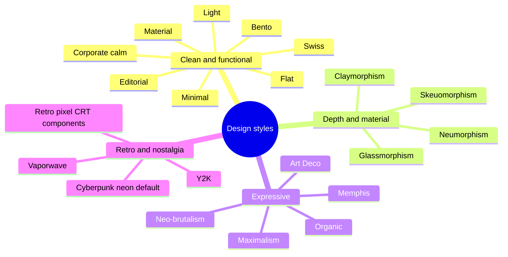

# Cyberdyne Design System

A comprehensive Svelte 5 component library built for **Cyberdyne** — powering products across Crypto, Machine Learning, and Research.

Dark-first, cyberpunk-inspired design system with **247 components** across 18 categories, design tokens, and full Storybook documentation.

## Storybook

**Live documentation:** [https://cyberdynecorp.github.io/svelte_components_library/](https://cyberdynecorp.github.io/svelte_components_library/)

**Local development:**

```bash
pnpm install
pnpm dev
# → http://localhost:6006
```

**Build static docs:**

```bash
pnpm build-storybook
# Output → docs/
```

The Storybook includes:
- Interactive component playground with controls
- Auto-generated API documentation for every component
- Design token reference (colors, typography, spacing)
- Getting started guide and architecture overview

All stories use the `args` pattern for Storybook Svelte CSF compatibility. Visual regression testing is handled via Playwright.

## Packages

| Package | Description |
|---------|------------|
| `@cyberdynecorp/svelte-ui-foundation` | Design tokens, CSS custom properties, typography, colors, spacing, animations |
| `@cyberdynecorp/svelte-ui-core` | 247 UI components across 18 categories |

## Installation

```bash
# Configure registry
echo "@cyberdynecorp:registry=https://npm.pkg.github.com" >> .npmrc

# Install
pnpm add @cyberdynecorp/svelte-ui-foundation @cyberdynecorp/svelte-ui-core

# Optional — only if you use the cesium/ 3D globe components
pnpm add cesium
```

> The `cesium/` category requires the optional `cesium` peer dependency plus
> consumer-side asset hosting (`CESIUM_BASE_URL`). See the `Overview/Cesium
> Integration` page in Storybook and `documentation/CESIUM_ROADMAP.md`.

### Setup

Import the foundation styles in your root layout:

```svelte
<script>
  import "@cyberdynecorp/svelte-ui-foundation/styles";
</script>

{@render children()}
```

Optional calm theme preset (`data-theme="calm"` / `"calm-dark"`) and light/dark/system
preference with a no-flash init script:

```svelte
<script>
  import "@cyberdynecorp/svelte-ui-foundation/styles";
  import "@cyberdynecorp/svelte-ui-foundation/themes/calm.css";
  import { ThemeToggle } from "@cyberdynecorp/svelte-ui-core";
</script>

<ThemeToggle includeSystem themes={{ light: "calm", dark: "calm-dark" }} persistKey="app.theme" />
```

`createThemePreference` and `themeInitScript` live in `@cyberdynecorp/svelte-ui-foundation/theme`;
see `Overview/Design Tokens` → Themes in Storybook for the `app.html` snippet.

Design-style presets — CSS-only themes, one file each, activated with `data-theme`:

```svelte
<script>
  import "@cyberdynecorp/svelte-ui-foundation/styles";
  import "@cyberdynecorp/svelte-ui-foundation/themes/glass.css";
</script>

<div data-theme="glass">…</div>
```



| Style | Theme (`data-theme`) | Import |
|-------|----------------------|--------|
| Cyberpunk / neon | default (no attribute) | `styles` |
| Light | `light` | `styles` |
| Corporate / calm | `calm`, `calm-dark` | `themes/calm.css` |
| Retro / pixel / CRT | — (use the `retro/` components) | — |
| Minimal | `minimal` | `themes/minimal.css` |
| Flat | `flat` | `themes/flat.css` |
| Material | `material` | `themes/material.css` |
| Swiss | `swiss` | `themes/swiss.css` |
| Organic | `organic` | `themes/organic.css` |
| Maximalism | `maximalism` | `themes/maximalism.css` |
| Y2K | `y2k` | `themes/y2k.css` |
| Glassmorphism | `glass` | `themes/glass.css` |
| Neumorphism | `neumorphism` | `themes/neumorphism.css` |
| Skeuomorphism | `skeuomorphism` | `themes/skeuomorphism.css` |
| Neo-brutalism | `brutalism` | `themes/brutalism.css` |
| Bento | `bento` | `themes/bento.css` |
| Claymorphism | `clay` | `themes/clay.css` |
| Memphis | `memphis` | `themes/memphis.css` |
| Vaporwave | `vaporwave` | `themes/vaporwave.css` |
| Art Deco | `art-deco` | `themes/art-deco.css` |
| Editorial | `editorial` | `themes/editorial.css` |

Every preset defines all semantic/component tokens and passes WCAG AA on the same pairings as
calm. Presets name their web fonts but do not load them; see each file's header.

Use components:

```svelte
<script>
  import {
    Button, Card, TextInput, Badge,
    TokenBalance, Terminal, CommandPalette
  } from "@cyberdynecorp/svelte-ui-core";
</script>

<Card variant="elevated">
  <TextInput label="Search" placeholder="Search transactions..." />
  <Button variant="brand">Execute</Button>
  <Badge variant="success">Online</Badge>
</Card>
```

## Components (247)

### Primitives (14)
`Button` · `Badge` · `Icon` (20+ built-in) · `IconButton` · `Avatar` · `Tooltip` · `ChipButton` · `ToggleGroup` · `AvatarGroup` · `Flag` · `InformationPill` · `CopyButton` · `ThemeToggle` · `StarRating`

### Forms (21)
`TextInput` · `PasswordInput` · `Select` · `Checkbox` · `Radio` · `Switch` · `Textarea` · `FileDropzone` · `DateRangePicker` · `MultiSelect` · `TagInput` · `NumberInput` · `MoneyInput` (locale money entry as decimal strings; crypto/custom assets via `decimals`) · `ComboBox` · `RangeSlider` · `CodeEditor` · `ColorPicker` · `SearchInput` · `DatePicker` · `TimePicker` · `ScheduleConfig`

### Feedback (13)
`Alert` · `Dialog` · `Notification` · `Toast` (queue manager) · `Skeleton` (loading placeholders) · `Accordion` · `Dropdown` · `ProgressRing` · `Stepper` · `ErrorBoundary` · `Carousel` · `VideoPlayer` · `GlobeLoader` (animated canvas globe loader)

### Navigation (10)
`Tabs` · `Breadcrumb` · `Sidebar` · `Header` · `MenuItem` · `BreadcrumbOverflow` · `NavBar` · `MegaMenu` · `MenuBar` · `BottomNav`

### Data Display (20)
`Table` (sortable columns) · `Pagination` · `ProgressBar` · `StatusBadge` · `EmptyState` · `StickyNote` · `VirtualizedList` · `InfiniteScroll` · `FileTree` · `DiffViewer` · `Calendar` · `Kanban` · `DataTable` · `FilterBar` · `SortableList` · `OrgChart` · `WeatherCard` · `CurrencyDisplay` (locale money amounts, crypto/custom assets via `decimals`, masked mode) · `KpiCard` (KPI tile with trend + delta; `value` takes a string or a snippet) · `BudgetBar` (money budget meter)

### Layout (9)
`Card` · `AppLayout` · `PageHeader` · `ContentSlot` · `Drawer` (focus trap, Escape / backdrop close, `closeLabel`, `onclose`) · `SplitView` · `GridLayout` · `PageShell` · `FloatingPanel` (draggable + resizable window)

### Overlay (5)
`Modal` · `ModalBackdrop` · `ContextMenu` · `Popover` · `CommandPalette` (Cmd+K)

### Auth (2)
`LoginPage` (credentials + wallet modes) · `WalletConnect` (MetaMask, WalletConnect, Coinbase, Phantom)

### Chat (8)
`Chatbox` · `ChatPanel` · `ChatResponse` · `PromptExample` · `WelcomeText` · `BotAnswer` · `CommentThread` · `ChatSidebar` (conversation list with rename/delete)

### Crypto / Web3 (13)
`TokenBalance` · `TransactionList` · `AddressDisplay` · `NetworkBadge` · `NFTCard` · `PriceDisplay` · `MetricCard` · `GasEstimate` · `TierBadge` (6-tier NFT access system) · `SwapInterface` · `TokenSelector` · `StakingCard` · `TransactionConfirm`

### ML / Data Tools (11)
`CodeBlock` (syntax highlighting) · `Terminal` · `LogViewer` (severity filtering) · `Slider` · `StepProgress` · `Timeline` · `DataChart` (chart wrapper) · `Kbd` (keyboard shortcuts) · `NotebookCell` · `ModelCard` · `ConfusionMatrix`

### Graph & Search (2)
`GraphViewer` (force-directed network graph with community detection, zoom/pan, search) · `SemanticSearch` (vector search results with relevance scores)

### Charts (21)
`LineChart` · `BarChart` · `AreaChart` · `HeatmapChart` · `PieChart` · `Sparkline` · `Gauge` · `TreeMap` · `GanttChart` · `ActivityHeatmap` · `CumulativeFlow` (CFD) · `AgingWIP` · `BurndownChart` · `VelocityChart` · `SankeyChart` · `ScatterChart` · `VennDiagram` · `WordCloud` · `ElevationProfile` (terrain cross-section + Fresnel overlay) · `ChartFrame` (accessible figure: title/description + data-table fallback with "Show data" toggle) · `ChartLegend` (shape and dash markers, readable in grayscale)

Every `ChartFrame` chart (Line, Area, Bar, Pie, Scatter, TreeMap, Sankey, Sparkline, Gauge, Heatmap) takes a typed `labels` prop to localize its accessible name, data-table column headers and caption, "Show data"/"Hide data" toggle and legend name, e.g. `labels={{ columns: { label: "Categoria", value: "Valor" }, showData: "Mostrar dados" }}`.

`LineChart`, `AreaChart`, `BarChart`, `PieChart`, `Sparkline`, `SankeyChart`, `ScatterChart`, `TreeMap`, `Gauge` and `HeatmapChart` accept `title` / `description` and render a screen-reader data table; the series charts also mark series with shapes as well as colour. `AgingWIP` and `GanttChart` bars become named, keyboard-operable buttons (Enter/Space) only when `onitemclick` / `onTaskClick` is set; otherwise the chart is a single image. Every chart story runs axe in failing mode (`parameters.a11y.test = "error"`).

`SankeyChart` and `Sparkline` take `formatValue?: (value: number) => string` for displayed values; in `SankeyChart` it applies to node labels, tooltips and the data table, e.g. `formatValue={(v) => new Intl.NumberFormat("pt-BR", { style: "currency", currency: "BRL" }).format(v)}`. Sankey node label size follows the body-sm scale (`0.875rem`) and can be overridden with `--cy-sankey-label-size`.

### Editor (6)
`BlockEditor` (Notion-style blocks with slash menu) · `MarkdownEditor` (with Mermaid diagram support) · `MarkdownPreview` · `MarkdownToolbar` · `MindMap` · `RichTextEditor` (WYSIWYG)

### Maps (1)
`MapView` (Leaflet with dark tiles, custom controls, geolocation)

### Cesium — 3D Globe (50)
Headless, controlled CesiumJS globe toolkit. `cesium` is an **optional peer dependency** (lazy-imported, never bundled). Entity/billboard layers take a uniform `opacity` (0–1); tracked-entity layers take `labelMode` (`all`/`perEntity`/`selected`/`none`); `TrackedEntitiesLayer` is the styling escape hatch.
- **Engine:** `CesiumGlobe` · `Terrain` · `ImageryLayer`
- **Tilesets/models/contours:** `Cesium3DTiles` · `OsmBuildingsLayer` · `GooglePhotorealisticTiles` · `ModelsLayer` · `ElevationContours`
- **Vector:** `GeoJsonLayer` · `KmlLayer` · `CzmlLayer` · `MarkersLayer` · `PolygonsLayer` · `PolylinesLayer` · `LabelsLayer` · `PolygonHeatmapsLayer`
- **Live entities:** `TrackedEntitiesLayer` · `AircraftLayer` · `VesselsLayer` · `SatellitesLayer` · `EarthquakesLayer` · `WildfiresLayer` · `VolcanoesLayer` · `AirportsLayer` · `TowersLayer` · `CellSitesLayer` · `WebcamsLayer` · `PowerPlantsLayer` · `AirQualityLayer` · `TideGaugesLayer` · `GdacsLayer` · `TsunamiLayer` · `CyclonesLayer` · `AuroraLayer` · `SubmarineCablesLayer` · `FarmsLayer` · `CoverageLayer` · `UserLocationLayer`
- **Raster timelines:** `WeatherTileLayer` · `NasaGibsLayer`
- **Particles/flow:** `WindParticlesLayer` · `WaveParticlesLayer` · `StreamlinesLayer` · `WindSimDomainPreview`
- **Chrome:** `CesiumControls` · `CesiumCompass` · `CesiumCoordinatesHud` · `CesiumLayerControl` · `BaseLayerPicker` · `CesiumMinimap`

### Flow / Node Editor (8)
`NodeEditor` (pan/zoom canvas with edge dragging and drop targets) · `FlowNode` (draggable node card with typed ports) · `FlowPort` (typed in/out port primitive) · `FlowEdge` (bezier connector with flow animation) · `NodePalette` (grouped, filterable, draggable palette) · `NodeInspector` (tabbed inspector shell) · `FlowMinimap` (graph overview with click-to-pan) · `FlowCanvasControls` (zoom in/out/fit/reset cluster)

### Retro — CyberdyneOS Desktop (36)
Pixel desktop-OS aesthetic for DAO / DeFi surfaces.
- **Desktop shell:** `RetroWindow` · `WindowManager` (store) · `WindowStatusBar` · `StartMenu` · `LauncherMenu` · `Taskbar` · `DesktopIcon` · `DesktopGrid` · `RetroTerminal` · `BootScreen` · `Clock` · `CRTBackground` · `CRTEffect`
- **Pixel primitives:** `PixelButton` · `PixelInput` · `PixelCheckbox` · `PixelRadio` · `PixelToggle` · `PixelTabs` · `PixelScrollArea` · `PixelTooltip` · `PixelAlert` · `PixelProgressBar` · `PixelNotification` · `PixelFileIcon` · `RetroContextMenu`
- **DAO/DeFi widgets:** `ConnectWalletModal` · `StatCard` · `ProposalRow` · `StatusDotList` · `ShoppingCartPanel` · `LiquidityRangeBar` · `LiquidityPositionCard` · `PoolRangeHistogram` · `TokenPairIcon` · `PriceChart` · `DepthChart` · `TVLSparkline`

## Trading

UI kit for futures trading screens (`trading/`). Components are UI only: they never call an exchange, and every action is reported through a callback. Prices and sizes are **decimal strings** rounded with string/BigInt maths (`roundToTick`, `roundToStep`, `formatPrice`, `formatSize`, plus `addDecimal` / `subtractDecimal` / `multiplyDecimal` / `divideDecimal` / `compareDecimal`), so orders never carry float noise. Colours come from the `--color-trade-long/short{,-bg,-text}` tokens.

### Trading — order entry

`OrderTicket` · `LeverageSlider` · `PositionsTable` · `OpenOrdersTable`

```svelte
<OrderTicket
  market={btcUsdt}
  available="2500"
  referencePrice={ticker.mark}
  makerFee="0.0002"
  takerFee="0.0005"
  estimateLiquidation={(draft) => myExchange.liqPrice(draft)}
  bind:price
  onsubmit={(draft) => api.placeOrder(draft)}
/>
```

`market` is a `MarketSpec` (`tickSize`, `stepSize`, `minSize`, `maxSize?`, `minNotional?`, `maxLeverage`), `available` the available margin in the quote asset, `referencePrice` (mark or last) the entry of market orders, and `bind:price` lets an order-book click fill the limit price. `estimateLiquidation` is optional; without it the liquidation row is hidden.

- **`OrderTicket`**: Long/Short radio group, market / limit / stop-market / stop-limit, size in base or quote (`MoneyInput` asset mode), a size-percentage slider of `available` × leverage, `LeverageSlider`, cross/isolated, reduce-only, post-only (limit only), time in force (limit and stop-limit), take profit / stop loss.
  - **Validation** (inline, blocks submit): required price / trigger per type, `minSize` / `maxSize`, `minNotional`, initial margin ≤ `available` (skipped for reduce-only), 1 ≤ leverage ≤ `maxLeverage`, take profit above / stop loss below the entry for longs and the reverse for shorts. The entry is the limit price (limit, stop-limit), the trigger (stop-market) or `referencePrice` (market).
  - **Preview**: notional, initial margin (= notional ÷ leverage, rounded up) and estimated fee. The fee uses `makerFee` only for post-only limit orders; every other order (market, stop, IOC/FOK, plain GTC limits that may cross the book) uses `takerFee`, so the estimate is never too low.
  - **`onsubmit(draft)`** receives a normalized `OrderDraft`: prices rounded to `tickSize` (nearest), size rounded **down** to `stepSize` and converted to base (`sizeUnit: "base"`), only the fields the order type uses. 1000 USDT at a 64000 limit becomes `size: "0.015"`.
- **`LeverageSlider`**: `input[type=range]` from 1× to `max` with `aria-valuetext` ("20×"), a synced numeric input and quick-set `marks`. ←/↓ and →/↑ step by 1×, Page Up/Down by 10×, Home/End jump to the ends. `bind:value`, `onchange`.
- **`PositionsTable`** / **`OpenOrdersTable`**: real tables (caption, column and row headers). Pass `markets: Record<symbol, MarketSpec>` for price / size precision; rows without a spec show the raw strings. PnL is signed and coloured with the trade tokens; `roe` is a percentage string ("13.75" → "+13.75%"). Actions are intents only — `onclose(position, "market" | "limit")`, `onedittpsl(position)`, `oncancel(order)`, `oncancelall()` — and a button only renders when its callback is set; the tables change only when the consumer updates `positions` / `orders`. Both show an empty state.
- **`labels`**: every visible and accessible string can be replaced (`DEFAULT_ORDER_TICKET_LABELS`, `DEFAULT_LEVERAGE_LABELS`, `DEFAULT_POSITIONS_LABELS`, `DEFAULT_OPEN_ORDERS_LABELS`); messages with values are functions, e.g. ``errorMinSize: (min) => `Tamanho mínimo ${min}` ``.

## Design System

### Color Palette

Three signature colors mapping to Cyberdyne's domains:

| Color | Hex | Domain |
|-------|-----|--------|
| Neon Green | `#00ff41` | Crypto / Blockchain |
| Electric Cyan | `#00d4ff` | Machine Learning / Data |
| Violet | `#a855f7` | Research / Innovation |

Built on a 3-layer token architecture:
- **Layer 1 — Primitives:** Raw color values (`--primitive-green-10`)
- **Layer 2 — Semantic:** Purpose-based tokens (`--color-action-brand-default`)
- **Layer 3 — Component:** Scoped to components (`--btn-brand-bg`)

### Typography

| Font | Family | Usage |
|------|--------|-------|
| Space Grotesk | `--font-display` | Headings, hero text |
| Inter | `--font-body` | Body copy, form inputs |
| JetBrains Mono | `--font-mono` | Code, labels, data values |

### Theming

All components use CSS custom properties. Override any token:

```css
:root {
  --color-action-brand-default: #00e5ff;
  --color-bg-primary: #050510;
}
```

## Tech Stack

| Layer | Technology |
|-------|-----------|
| Framework | Svelte 5 (runes) |
| Styling | CSS Custom Properties |
| Types | TypeScript (strict) |
| Docs | Storybook 8 |
| Testing | Playwright (visual regression) |
| Build | Vite + svelte-package |
| Monorepo | pnpm workspaces |
| Versioning | Changesets |
| CI/CD | GitHub Actions |

## Development

```bash
# Clone
git clone git@github.com:CyberdyneCorp/svelte-components-library.git
cd svelte-components-library

# Install
pnpm install

# Storybook dev server
pnpm dev

# Build all packages
pnpm build

# Lint & type check
pnpm check

# Verify the core and foundation tarballs ship no tests/stories (after pnpm build)
pnpm check:package

# Format
pnpm format
```

### Versioning

```bash
pnpm changeset          # Create a changeset
pnpm version-packages   # Apply versions
pnpm release            # Build & publish
```

## Project Structure

```
├── .storybook/              Storybook config & static docs
│   ├── main.ts              Stories glob, addons, aliases
│   ├── preview.ts           Global styles & parameters
│   ├── manager.ts           Cyberdyne dark theme
│   └── static-docs/         Welcome, Getting Started, Design Tokens
├── .github/workflows/       CI/CD (test, release, publish-storybook)
├── packages/
│   └── ui/
│       ├── foundation/      Design tokens & global styles
│       │   └── src/lib/
│       │       ├── tokens/  TypeScript token definitions
│       │       ├── styles/  CSS (colors, typography, spacing, radius, animations)
│       │       ├── themes/  Optional theme presets (calm + 17 design styles)
│       │       └── theme/   Theme preference helper + pre-paint init script
│       └── core/            UI components (247 components)
│           └── src/lib/
│               ├── primitives/   Button, Badge, Icon, Avatar, ToggleGroup, AvatarGroup, ThemeToggle, StarRating, ...
│               ├── forms/        TextInput, Select, DateRangePicker, ColorPicker, SearchInput, DatePicker, TimePicker, ScheduleConfig, ...
│               ├── feedback/     Alert, Toast, Skeleton, Stepper, ProgressRing, ErrorBoundary, Carousel, VideoPlayer, GlobeLoader, ...
│               ├── navigation/   Tabs, Breadcrumb, Sidebar, Header, MenuItem, NavBar, MegaMenu, MenuBar, BottomNav, ...
│               ├── data/         Table, Pagination, VirtualizedList, FileTree, DiffViewer, Kanban, DataTable, FilterBar, SortableList, OrgChart, WeatherCard, ...
│               ├── layout/       Card, AppLayout, Drawer, SplitView, GridLayout, PageShell, FloatingPanel, ...
│               ├── overlay/      Modal, ContextMenu, Popover, CommandPalette
│               ├── auth/         LoginPage, WalletConnect
│               ├── chat/         Chatbox, ChatPanel, ChatResponse, CommentThread, ChatSidebar, ...
│               ├── crypto/       TokenBalance, NFTCard, GasEstimate, TierBadge, SwapInterface, StakingCard, ...
│               ├── ml/           CodeBlock, Terminal, LogViewer, Timeline, NotebookCell, ModelCard, ConfusionMatrix, ...
│               ├── graph/        GraphViewer (force-directed), SemanticSearch
│               ├── charts/       LineChart, BarChart, AreaChart, PieChart, Sankey, Scatter, Venn, Gantt, ElevationProfile, ... (19)
│               ├── editor/       BlockEditor, MarkdownEditor, MarkdownPreview, MarkdownToolbar, MindMap, RichTextEditor
│               ├── maps/         MapView (Leaflet)
│               ├── cesium/       CesiumGlobe + 48 layers/chrome (3D globe; optional cesium peer dep)
│               ├── retro/        RetroWindow, Taskbar, WindowManager, Pixel* primitives, DeFi widgets (36)
│               ├── flow/         NodeEditor, FlowNode, FlowPort, FlowEdge, NodePalette, ... (node-graph editor)
│               └── _testdata/    Shared test data module for stories
└── docs/                    Built Storybook output
```

## Target Products

This design system is built to support:

- **CyberdyneDAO** — Web3 terminal platform with NFT-gated access
- **YieldPath** — AI-powered DeFi life planner
- **Vision Factory** — Computer vision ML pipeline
- **Terraform Game** — Blockchain RTS strategy game
- **Research Tools** — Internal ML & data exploration interfaces

## License

Private — Cyberdyne Corp.
